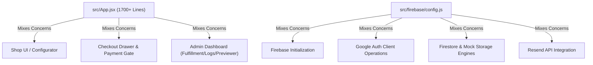
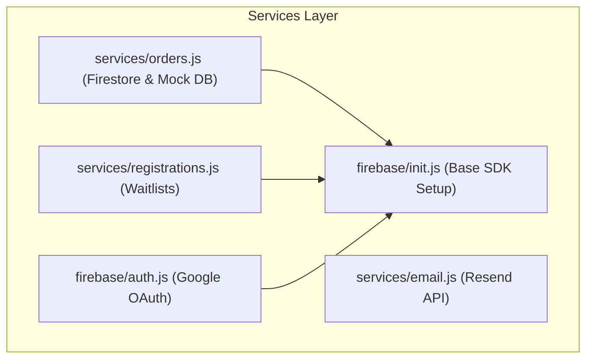

# 🔍 Code Review & Refactoring Blueprint — Rene Puskas Jewelry Shop

This document analyzes the current architecture, details key design decisions, and proposes a highly modular refactoring plan to improve maintainability, separation of concerns, and ease of expansion.

---

## 1. Executive Summary & Core Challenges

The current codebase is functional, responsive, and robust, with a complete local-mock fallback. However, as the application has pivoted from a simple landing page into an interactive pre-order store and administrative control panel, two primary bottlenecks have emerged:



### Key Areas for Refactoring:
1. **Monolithic Component (`src/App.jsx`):** Spans over 1,700 lines. It controls frontend routing, product configuration, interactive size guides, checkout flows, success modals, and the entire multi-tab administrative fulfillment console.
2. **Coalesced API File (`src/firebase/config.js`):** Contains Firebase initialization, Firestore rule checks, Google OAuth, mock localStorage fallbacks, and the Resend API transactional mailing engine.

---

## 2. Refactoring Proposal: Component Decoupling (`src/components/`)

We can isolate focused, stateless, and stateful components to make `App.jsx` a clean router and global state provider.

### Proposed Directory Structure:
```text
src/
├── components/
│   ├── layout/
│   │   ├── Header.jsx          # Premium minimalist brand navigation & mobile menu
│   │   └── Footer.jsx          # Brand philosophy & copyright info
│   ├── store/
│   │   ├── Configurator.jsx    # Metal, Stone, & Length visual configurator
│   │   ├── SizeGuideModal.jsx  # Bracelet size guidelines & printable tape
│   │   └── CheckoutDrawer.jsx  # Slide-out checkout form & order pricing card
│   ├── feedback/
│   │   ├── PaymentLoader.jsx   # Premium 2-second dark transaction screen
│   │   └── SuccessModal.jsx    # Minimalist thank-you overlay with serial order ID
│   └── admin/
│       ├── AdminLogin.jsx      # Guarded code authorization portal
│       ├── OrdersTab.jsx       # Order management, batch tools, & DHL shipping dispatch
│       ├── WaitlistTab.jsx     # Drops registration CSV directories
│       └── EmailPreviewTab.jsx # Iframe preview frame of HSL dark templates
```

### Component Specification:
* **`CheckoutDrawer.jsx`**: Decouple shipping address forms and payment gate selections. It takes order configurations as props and emits the checkout submit payload.
* **`Admin/OrdersTab.jsx`**: Encapsulates the admin order table, individual DHL fulfillment fields, and the batch action buttons to advance stages.

---

## 3. Refactoring Proposal: API & Service Separation (`src/services/`)

Splitting `src/firebase/config.js` into targeted modules eliminates large conditional files and makes testing mock behavior straightforward.



### 1. Database & Authentication Modules
* **`src/firebase/init.js`**: Pure Firebase application and client Firestore initialization.
* **`src/firebase/auth.js`**: `loginWithGoogle` helper logic.
* **`src/services/orders.js`**: Handles saving and retrieving orders, stage updates, and mock fallbacks (`isMockFirebase` logic).
* **`src/services/registrations.js`**: Handles waitlist additions, mark-exported mutations, and CSV helpers.

### 2. Sourcing E-Mail Service
* **`src/services/email.js`**: Dedicated Resend API runner. Contains only the `sendResendEmail` POST fetch caller and mock email logging logic, keeping Firestore database code decoupled from transactional emails.

---

## 4. State Management Recommendation

Currently, global configuration states (e.g. selected stones, current tab, pricing, loading states) are passed drill-style. As the application grows, introducing a simple **React Context** will keep components incredibly readable:

```javascript
// src/context/ShopContext.jsx
import { createContext, useContext, useState } from "react";

const ShopContext = createContext();

export function ShopProvider({ children }) {
  const [selectedMetal, setSelectedMetal] = useState(defaultMetal);
  const [selectedStone, setSelectedStone] = useState(defaultStone);
  const [selectedLength, setSelectedLength] = useState(defaultLength);
  
  // Shared price utility
  const totalPrice = 165 + selectedMetal.priceOffset;

  return (
    <ShopContext.Provider value={{ selectedMetal, setSelectedMetal, selectedStone, setSelectedStone, selectedLength, setSelectedLength, totalPrice }}>
      {children}
    </ShopContext.Provider>
  );
}

export const useShop = () => useContext(ShopContext);
```

---

## 5. Architectural Benefits

| Metric | Before Refactoring | After Refactoring |
| :--- | :--- | :--- |
| **`App.jsx` Size** | ~1715 lines | ~120 lines (routing & provider) |
| **Separation of Concerns** | Low (UI & API co-located) | High (Independent UI and Services) |
| **Testability** | Complex (Requires mocking the entire DOM) | High (Pure database & email unit tests) |
| **Maintainability** | Moderate (Risk of unintended UI side-effects) | High (Modular atomic components) |
