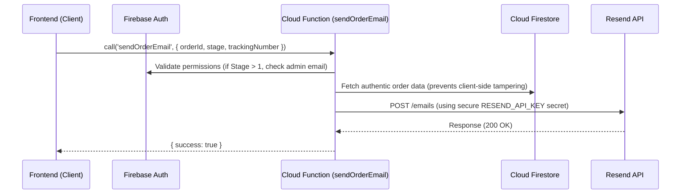

# Implementation Plan: Secure Backend Email Migration

Migrate the transactional email-sending logic from the client browser to a secure Firebase Cloud Function (v2). This resolves the CORS issue when calling Resend directly from the client and secures the private `RESEND_API_KEY` in Google Cloud Secret Manager.

---

## User Review Required

> [!IMPORTANT]
> **API Key Migration:** 
> You will need to store your Resend API Key in your production Firebase environment using the Firebase CLI:
> `firebase functions:secrets:set RESEND_API_KEY="re_..."`
> The local frontend `.env` file will no longer require the raw `VITE_RESEND_API_KEY` for live emails, protecting it from public visibility.
>
> **Mock Dev Support:**
> Offline and local development will continue to use a high-fidelity local `localStorage` mock email log so you can build and test completely offline without calling Cloud Functions.

---

## Proposed Changes

We will migrate email generation and delivery to a Firebase Cloud Function using Firebase Functions v2 Callable endpoints.



### 1. Backend: Cloud Functions Setup

Configure dependencies, port template rendering, and write the secure backend callable handler.

#### [NEW] [emailTemplates.js](file:///Users/rene/Documents/Projekte/shop/functions/emailTemplates.js)
* Port HSL dark-themed transactional mail template rendering from `src/firebase/emailTemplates.js` to CommonJS for Cloud Functions.

#### [MODIFY] [index.js](file:///Users/rene/Documents/Projekte/shop/functions/index.js)
* Implement `sendOrderEmail` using `onCall` (v2) with secret `RESEND_API_KEY`.
* Restrict `stage > 1` (Admin transitions) to authenticated users matching `rene.puskas@googlemail.com`.
* Retrieve order records directly from Firestore via `firebase-admin` to prevent mail parameter spoofing.
* Send request to Resend API using standard Node.js native `fetch`.

---

### 2. Frontend: Client SDK Integration

Configure Firebase Functions inside the client initialization and refactor the email service to invoke the Cloud Function.

#### [MODIFY] [init.js](file:///Users/rene/Documents/Projekte/shop/src/firebase/init.js)
* Initialize and export the Firebase Functions SDK handler (`getFunctions`).

#### [MODIFY] [config.js](file:///Users/rene/Documents/Projekte/shop/src/firebase/config.js)
* Re-export `functions` from client config.

#### [MODIFY] [email.js](file:///Users/rene/Documents/Projekte/shop/src/services/email.js)
* Refactor `sendResendEmail` to invoke the Cloud Function via `httpsCallable(functions, "sendOrderEmail")` when in live mode.
* Keep the offline `localStorage` mock-mail previewer fully functional in development mode.

---

## Verification Plan

### Backend Function Testing (Emulators)
* Run local Firebase emulator suite to test the callable Cloud Function:
  ```bash
  firebase emulators:start
  ```

### Manual Verification
1. **Mock Checkout Verification:** Perform a mock pre-order locally. Verify that mock email logging still records details in the local Admin Email Previewer tab.
2. **Production Pre-Order Deployment:** Verify that completing a pre-order in production triggers the Stage 1 welcome email through the secure Cloud Function with zero CORS errors.
3. **Fulfillment Board Trigger:** As Admin (`rene.puskas@googlemail.com`), transition an order's stage. Verify that stages 2, 3, and 4 generate and dispatch emails properly, and that unauthenticated clients are blocked from executing admin stages.
