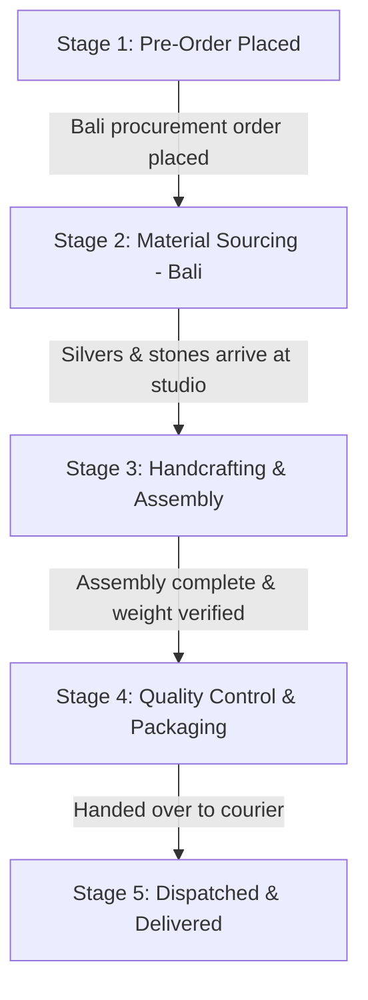

# Pre-Order Lifecycle & Production Tracking System

This document outlines the architecture, database schema, user experience, and technical implementation steps to shift our **Rene Puskas** showcase from a passive waitlist (limited-drop) model to a high-transparency **Pre-Order Sourcing & Production Tracker**.

---

## 1. Overview & Philosophy
Buying a quiet-luxury, handcrafted product is an emotional contract of trust. A standard e-commerce receipt does not build this connection. 
By exposing our actual **8-week supply chain** (Bali raw procurement, custom German handcrafting, high-density packaging, and secure delivery), we turn a long waiting time into an immersive, premium story of honest craftsmanship.

Instead of bulk email blasting (via MailerLite/Mailchimp), we will build a **decoupled custom tracking system** hosted entirely in our Firebase environment. This guarantees real-time synchronicity between production milestones and customer visibility.

---

## 2. The 5-Stage Production Lifecycle
Every pre-order moves through five distinct, traceable milestones. Each phase is visually represented on the customer-facing tracking page with specific micro-copy and imagery.



### Stage Details & Customer Messaging:
1. **Stage 1: Pre-Order Confirmed (Payment Secured)**
   - *Internal Trigger:* Firestore payment webhook successfully resolved.
   - *Customer Experience:* "Order secured. Metal and mineral counts compiled for raw materials order."
2. **Stage 2: Sourcing Raw Materials (Bali Procurement) — Weeks 1 to 5**
   - *Internal Trigger:* Procurement order submitted to Balinese silver and mineral partners.
   - *Customer Experience:* "Your ethically sourced 925 sterling silver and organic volcanic stones are being gathered, custom-cast, and hand-selected in Bali."
3. **Stage 3: Handcrafting & Assembly (Studio) — Weeks 6 to 7**
   - *Internal Trigger:* Raw materials arrive at the local assembly studio.
   - *Customer Experience:* "Your custom configurator elements are being hand-brushed and threaded onto our high-tensile 1.0mm stainless steel wire core."
4. **Stage 4: Quality Control & Packaging — Week 8**
   - *Internal Trigger:* Assembly finished. Sizing and hardware force checks initiated.
   - *Customer Experience:* "Final tension, magnetic lock security, and weight verification in progress. Hand-wrapped in our luxury obsidian-tone linen packaging."
5. **Stage 5: Dispatched & In Transit**
   - *Internal Trigger:* Shipping label generated.
   - *Customer Experience:* "Handed over to premium courier (e.g. DHL Express). Tracking link attached."

---

## 3. Database Schema (`/orders` in Cloud Firestore)

Each pre-order will be saved in a private `orders` collection in Firestore. We will transition from simple email leads to secure transaction documents.

```typescript
interface Order {
  id: string;                // Secure, high-readability Order ID (e.g. RP-2026-X8B4)
  email: string;             // Customer identifier
  customerName: string;      // Customer full name
  createdAt: Timestamp;      // Timestamp of purchase
  
  // Product configuration captured during purchase
  configuration: {
    productId: string;
    metal: 'silver' | 'gold' | 'rose-gold';
    stones: 'agate' | 'black-trio';
    length: number;          // Sizing in cm
    basePrice: number;
    priceModifier: number;
    totalPrice: number;
  };
  
  // Sourcing & Production State
  productionStatus: {
    currentStage: 1 | 2 | 3 | 4 | 5; // The 5 stages of our lifecycle
    lastUpdated: Timestamp;
    estimatedDelivery: string;        // Dynamic delivery window (e.g. "July 12 - July 18")
    stageHistory: Array<{
      stage: number;
      timestamp: Timestamp;
      notes: string;                  // Custom message e.g. "Silver cast finished."
    }>;
  };
  
  // Fulfillment & Logistics
  shipping: {
    carrier: 'DHL Express' | 'UPS' | null;
    trackingNumber: string | null;
    address: {
      street: string;
      city: string;
      zip: string;
      country: string;
    };
  };
}
```

---

## 4. Customer Tracking Portal (`/track/:orderId`)

Instead of standard, boring transactional e-commerce pages, we will design an **Apple-style, high-end visual timeline** where customers can inspect the progress of their specific bracelet.

### Key Visual & UX Elements:
* **Minimalist Brand Identity:** Matte-black background (`hsl(220, 15%, 8%)`), warm coal containers, and razor-sharp luxury typography.
* **Interactive Sourcing Map / Storyboard:** A stylized visual showing *where* their bracelet currently is (e.g., a map overlay of Bali with custom material cards for silver/agate/lava when in Stage 2).
* **The "Live Progress" Bar:** A smooth, custom HSL-colored progress line representing the 8-week production meter. Micro-animations will show pulse states on the current stage.
* **Personalization Card:** A sleek, high-fidelity 3D-like digital card of the user's custom-built bracelet showing their selected options, reassuring them of their individual creation.
* **Zero Login Barriers:** To maximize accessibility, a secure token-based URL sent via email (e.g., `renepuskas.com/track/RP-2026-X8B4?token=secureToken`) will directly open their personal dashboard without requiring password generation.

---

## 5. Admin Control Panel (`/admin/production`)

To make managing pre-orders efficient and fast, we will expand our private Admin dashboard to include full order and lifecycle tracking controls.

### Core Features:
1. **Interactive Order Board (Kanban style or detailed Table):**
   - Filter orders by current stage (1 to 5).
   - Filter orders by metal configuration (e.g. "Select all 18k Gold Plated orders to batch-move them to Stage 2").
2. **Lifecycle Updater Actions:**
   - Quick dropdown to move an order to the next stage.
   - Text input to add a "Custom Sourcing Note" (e.g. *"We have selected your volcanic stripe-agate stones from Bali!"*) to give it a human, luxury-concierge touch.
3. **Automated Notification Switch:**
   - Toggle option: `[x] Notify customer via email about this status update`.

---

## 6. Sourcing Notifications (Resend API Integration)

As the user rightly identified, bulk platforms like MailerLite are not designed to sync dynamically with granular order statuses. 

Instead, we will use **Resend** or **Postmark** (developer-first transactional email APIs) paired with **Firebase Cloud Functions** to send beautifully styled, personalized HTML notifications.

### The Automated Flow:
1. The Admin updates an order in the `/admin/production` dashboard (e.g., moving order `RP-2026-X8B4` from Stage 2 to Stage 3).
2. A Firestore database trigger (`exports.onOrderUpdate = functions.firestore.document('orders/{orderId}').onUpdate(...)`) detects this change.
3. If `currentStage` has advanced, the Cloud Function dynamically loads a custom HTML template.
4. The Cloud Function calls the **Resend API** to instantly dispatch a highly styled email to the user.
5. **High-Fidelity Branding:** The email is styled using custom dark-mode aesthetic headers matching the landing page and containing a direct link button: **"Track Sourcing & Handcrafting"**.

---

## 7. Implementation Plan

To execute this architecture, we will break the build into three clear phases:

### Phase 1: Local Database & UI Layouts
* [ ] Create the new Firestore schema structure internally.
* [ ] Build the customer-facing `/track/:orderId` responsive route.
* [ ] Integrate an elegant, animated progress timeline components.
* [ ] Build Mock Order datasets in `localStorage` to allow testing the tracking view instantly in dev mode.

### Phase 2: Fulfillment Admin Panel
* [ ] Develop the `/admin/production` dashboard.
* [ ] Add quick-actions to advance stages, search by Order ID, and batch-update collections.
* [ ] Integrate manual custom-message fields for personalized customer updates.

### Phase 3: Cloud Trigger & Transactional Mailing (Resend Setup)
* [ ] Register a free **Resend** account and configure a custom domain (e.g., `noreply@renepuskas.com`).
* [ ] Deploy a secure Firebase Cloud Function that listens to `orders` updates.
* [ ] Implement high-end transactional email templates mapping the 5 stages.
